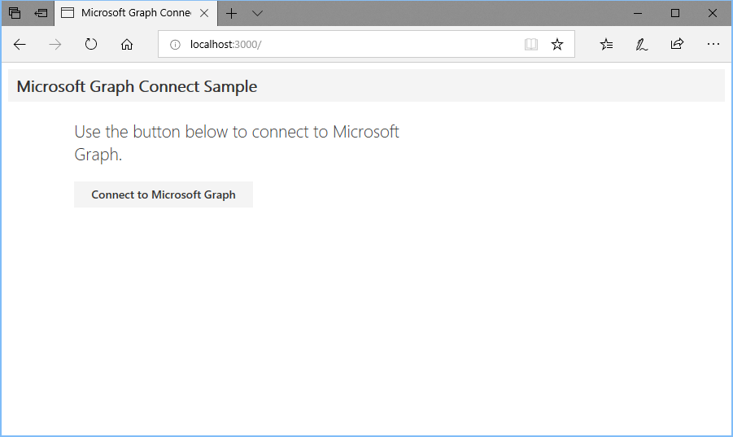
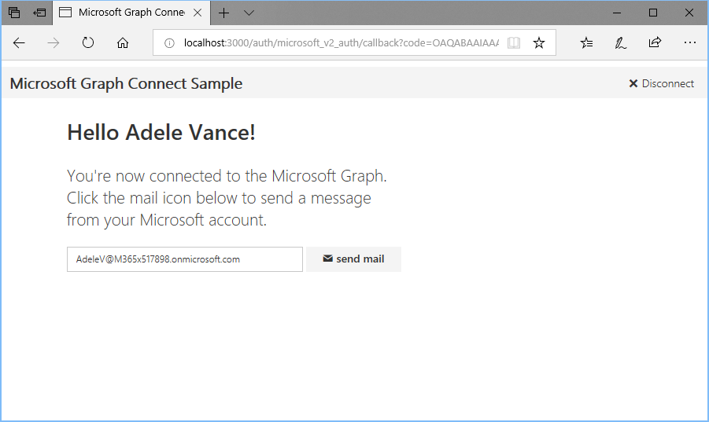
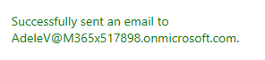

# Run the Microsoft Graph Ruby REST quick start sample

Thank you for downloading the Microsoft Graph Ruby REST quick start sample. Follow these instructions to run and try out the sample.

> **Note:** These instructions apply if you downloaded the sample via the [Microsoft Graph Quick Start](https://developer.microsoft.com/graph/quick-start) page. In addition to the quick start, we also provide the following alternatives to get started with Microsoft Graph and Ruby:
>
> - This sample is also available on [GitHub](https://github.com/microsoftgraph/ruby-connect-rest-sample). If you downloaded the sample from GitHub, please follow the instructions in the README file.
> - If you prefer to build your own app from scratch, see our [Microsoft Graph Ruby on Rails tutorial](/concepts/ruby.md).

## Prerequisites

Before you follow the instructions in this document, you'll need to make sure you have the following:

- [Ruby 2.5.1 or later](https://www.ruby-lang.org/)
- An Outlook.com account, or an Office 365 work or school account

## Build and run the sample

1. Run the following command to install [Bundler](http://bundler.io/).

    ```Shell
    gem install bundler
    ```

1. Run the following command to install the application's dependencies.

    ```Shell
    bundle install
    ```

1. Run the following command to start the application.

    ```Shell
    rackup -p 3000
    ```

## Using the sample application

1. Open a browser and navigate to `http://localhost:3000`.

    

1. Choose the **Connect to Microsoft Graph** button to sign in to your Outlook.com or Office 365 account.

1. Review and accept the requested permissions. The browser redirects back to the application.

    

1. Choose the **Send mail** button to send a message from the signed-in user to the signed-in user.

    

1. Choose the **Disconnect** button to sign out and return to the home page.

1. Check the user's mailbox for the message sent from the app. The subject of the message is `Welcome to Microsoft Graph development with Ruby on Rails`.

## Troubleshooting

If you run into any problems using this quick start, please check the [issues page on GitHub](https://github.com/microsoftgraph/ruby-connect-rest-sample/issues). If you can't find an answer to your problem in the existing issues there, please create a new issue, providing as much detail as possible.