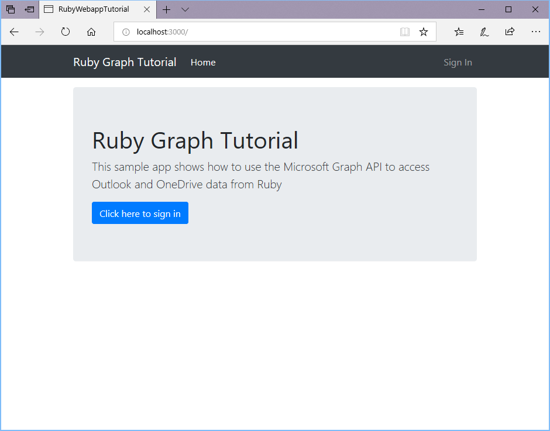
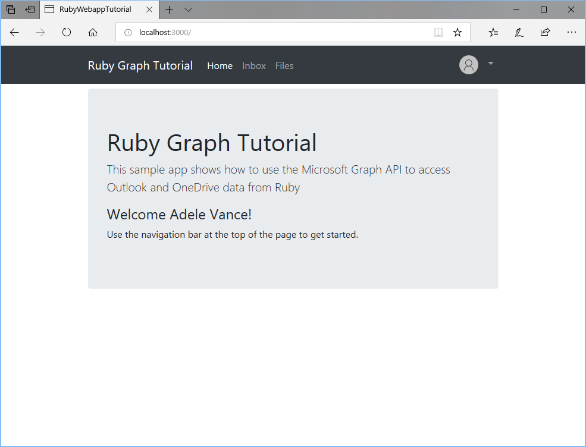
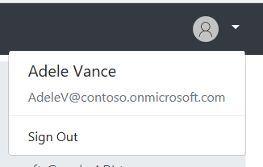
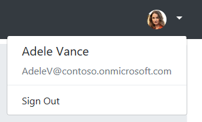
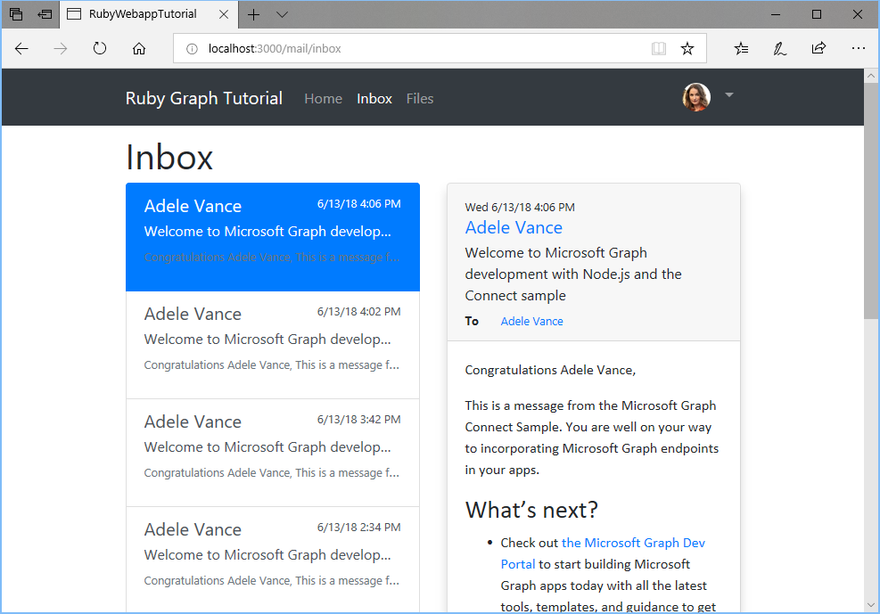
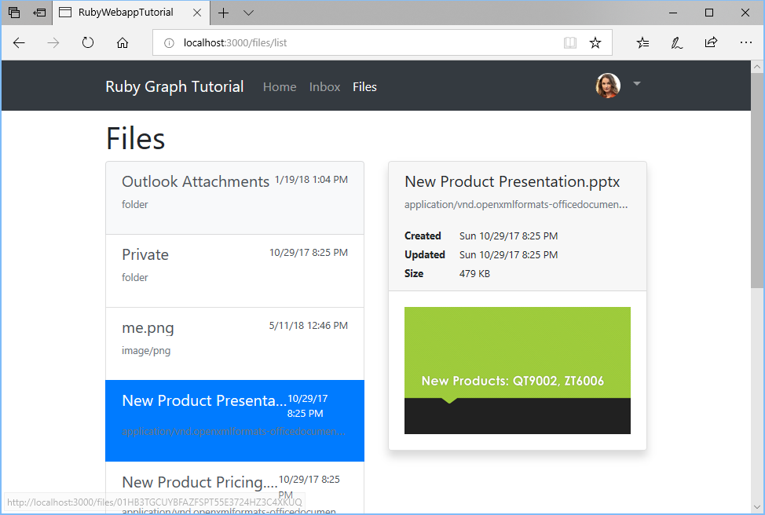

# Tutorial

## Prerequisites

Before you start this tutorial, you should have [Ruby](https://www.ruby-lang.org) installed on your development machine.

> **Note:** This tutorial was written with Ruby version 2.5.1. The steps in this guide may work with other versions, but that has not been tested.

## Create the app

We'll be using [Ruby on Rails](https://rubyonrails.org/) as the framework for the app we'll build in this tutorial. If you don't already have Rails installed, you can install it from your command-line interface (CLI) with the following command.

```Shell
gem install rails
```

Open your CLI, navigate to a directory where you have rights to create files, and run the following command to create a new Rails app.

```Shell
rails new ruby-webapp-tutorial
```

Rails creates a new directory called `ruby-webapp-tutorial` and scaffolds a Rails app.

> **Note:** If you are developing on Windows, as of this writing, there is a known problem with the [sqlite3 gem](https://github.com/sparklemotion/sqlite3-ruby/issues/228) and Ruby 2.5.1. To resolve this, open the `./Gemfile` file in your editor. Locate the `gem 'sqlite3'` line and change it to:
>
> ```ruby
> gem 'sqlite3', git: 'https://github.com/sparklemotion/sqlite3-ruby'
> ```
>
> Save your changes, then run `bundle install` from your CLI.
>
> Once the developers of the `sqllite3` gem release a 2.5-compatible version of the gem to [https://rubygems.org](https://rubygems.org/gems/sqlite3), this step will no longer be necessary.

Navigate to this new directory and enter the following command to start a local web server.

```Shell
rails server
```

Open your browser and navigate to `http://localhost:3000`. If everything is working, you will see a "Yay! You're on Rails!" message. If you don't see that message, check the [Rails getting started guide](http://guides.rubyonrails.org/).

Before we move on to replacing the default page with something more interesting, we'll install some additional gems that we'll use later:

- [omniauth-oauth2](https://github.com/omniauth/omniauth-oauth2) for handling sign-in and OAuth token flows.
- [httparty](https://github.com/jnunemaker/httpartyt) for making calls to Microsoft Graph.
- [nokogiri](https://github.com/sparklemotion/nokogiri) to process HTML bodies of email.
- [activerecord-session_store](https://github.com/rails/activerecord-session_store) for storing sessions in the database. The default cookie store is limited in size, and we're going to store tokens there that might make us go over the limit.

Run the following commands in your CLI.

```Shell
bundle add omniauth-oauth2
bundle add httparty
bundle add nokogiri
bundle add activerecord-session_store
rails generate active_record:session_migration
```

The last command generates output like the following:

```Shell
create  db/migrate/20180618172216_add_sessions_table.rb
```

Open the file that was created and locate the following line.

```ruby
class AddSessionsTable < ActiveRecord::Migration
```

Change that line to the following.

```ruby
class AddSessionsTable < ActiveRecord::Migration[5.2]
```

> **Note:** This assumes that you are using Rails 5.2.x. If you are using a different version, replace `5.2` with your version.

Save the file and run the following command.

```Shell
rake db:migrate
```

Finally, configure Rails to use the new session store. Create a new file called `session_store.rb` in the `./config/initializers` directory, and add the following code.

```ruby
Rails.application.config.session_store :active_record_store, :key => '_graph_app_session'
```

## Design the app

Let's start by adding [Bootstrap](http://getbootstrap.com/) for simple styling, and [Font Awesome](https://fontawesome.com/) for some simple icons. Then we'll define a global layout with a nav bar. Open `./app/views/layouts/application.html.erb` and replace its contents with the following.

```html
<!DOCTYPE html>
<html>
  <head>
    <title>RubyWebappTutorial</title>
    <%= csrf_meta_tags %>
    <%= csp_meta_tag %>

    <link rel="stylesheet" href="https://stackpath.bootstrapcdn.com/bootstrap/4.1.1/css/bootstrap.min.css" integrity="sha384-WskhaSGFgHYWDcbwN70/dfYBj47jz9qbsMId/iRN3ewGhXQFZCSftd1LZCfmhktB" crossorigin="anonymous">
    <link rel="stylesheet" href="https://use.fontawesome.com/releases/v5.1.0/css/all.css" integrity="sha384-lKuwvrZot6UHsBSfcMvOkWwlCMgc0TaWr+30HWe3a4ltaBwTZhyTEggF5tJv8tbt" crossorigin="anonymous">
    <script src="https://code.jquery.com/jquery-3.3.1.min.js"></script>
    <script src="https://cdnjs.cloudflare.com/ajax/libs/popper.js/1.14.3/umd/popper.min.js" integrity="sha384-ZMP7rVo3mIykV+2+9J3UJ46jBk0WLaUAdn689aCwoqbBJiSnjAK/l8WvCWPIPm49" crossorigin="anonymous"></script>
    <script src="https://stackpath.bootstrapcdn.com/bootstrap/4.1.1/js/bootstrap.min.js" integrity="sha384-smHYKdLADwkXOn1EmN1qk/HfnUcbVRZyYmZ4qpPea6sjB/pTJ0euyQp0Mk8ck+5T" crossorigin="anonymous"></script>
    <%= stylesheet_link_tag    'application', media: 'all', 'data-turbolinks-track': 'reload' %>
    <%= javascript_include_tag 'application', 'data-turbolinks-track': 'reload' %>
  </head>

  <body>
    <nav class="navbar navbar-expand-md navbar-dark fixed-top bg-dark">
      <div class="container">
        <%= link_to "Ruby Graph Tutorial", root_path, class: "navbar-brand" %>
        <button class="navbar-toggler" type="button" data-toggle="collapse" data-target="#navbarCollapse" aria-controls="navbarCollapse" aria-expanded="false" aria-label="Toggle navigation">
          <span class="navbar-toggler-icon"></span>
        </button>
        <div class="collapse navbar-collapse" id="navbarCollapse">
          <ul class="navbar-nav mr-auto">
            <li class="nav-item">
              <%= link_to "Home", root_path, class: "nav-link#{' active' if controller.controller_name == 'home'}" %>
            </li>
            <% if @user_name %>
              <li class="nav-item" data-turbolinks="false">
                <a class="nav-link" href="#">Inbox</a>
              </li>
              <li class="nav-item" data-turbolinks="false">
                <a class="nav-link" href="#">Files</a>
              </li>
            <% end %>
          </ul>
          <ul class="navbar-nav justify-content-end">
            <% if @user_name %>
              <li class="nav-item dropdown">
                <a class="nav-link dropdown-toggle" data-toggle="dropdown" href="#" role="button" aria-haspopup="true" aria-expanded="false">
                   class="rounded-circle align-self-center mr-2" style="width: 32px;">
                </a>
                <div class="dropdown-menu dropdown-menu-right">
                  <h5 class="dropdown-item-text mb-0"><%= @user_name %></h5>
                  <p class="dropdown-item-text text-muted mb-0"><%= @user_email %></p>
                  <div class="dropdown-divider"></div>
                  <a href="#" class="dropdown-item">Sign Out</a>
                </div>
              </li>
            <% else %>
              <li class="nav-item">
                <a href="#" class="nav-link">Sign In</a>
              </li>
            <% end %>
          </ul>
        </div>
      </div>
    </nav>
    <main role="main" class="container">
      <% if @errors %>
        <% @errors.each do |error| %>
          <div class="alert alert-danger" role="alert">
            <p class="mb-3"><%= error[:message] %></p>
            <%if error[:debug] %>
              <pre class="alert-pre border bg-light p-2"><code><%= error[:debug] %></code></error>
            <% end %>
          </div>
        <% end %>
      <% end %>
      <%= yield %>
    </main>
  </body>
</html>
```

That markup references `no-profile-pic.png`, which is a default avatar image for users that don't have one configured. You can use any PNG file you like, just name it `no-profile-pic.png` and place it in the `./app/assets/images` folder.

> **Note:** For your convenience, you can download the image used in this tutorial from [GitHub]().

Now open `./app/assets/stylesheets/application.css` and add the following to the end of the file.

```css
body {
  padding-top: 4.5rem;
}

.alert-pre {
  word-wrap: break-word;
  word-break: break-all;
  white-space: pre-wrap;
}
```

Now let's replace the default page with one of our own. Generate a home page controller with the following command.

```Shell
rails generate controller Home index
```

Then configure the `index` action on the `Home` controller as the default page for the app. Open `./config/routes.rb` and replace the contents with the following

```ruby
Rails.application.routes.draw do
  get 'home/index'
  root 'home#index'

  # Add future routes here

end
```

Now open the `./app/view/home/index.html.erb` file and replace its contents with the following.

```html
<div class="jumbotron">
  <h1>Ruby Graph Tutorial</h1>
  <p class="lead">This sample app shows how to use the Microsoft Graph API to access Outlook and OneDrive data from Ruby</p>
  <% if @user_name %>
    <h4>Welcome <%= @user_name %>!</h4>
    <p>Use the navigation bar at the top of the page to get started.</p>
  <% else %>
    <a href="#" class="btn btn-primary btn-large">Click here to sign in</a>
  <% end %>
</div>
```

Save all of your changes and restart the server. Now, the app should look very different.



Next, let's work on getting an access token via OAuth.

## Register the app

We're going to use the OAuth2 authorization code grant flow to obtain access tokens from Azure AD. Before we can do that, we must register the application to get an application ID and secret.

Head over to the [Application Registration Portal](https://apps.dev.microsoft.com/) to quickly get an application ID and secret.

1. Using the **Sign in** link, sign in with either your Microsoft personal account (Outlook.com), or your Microsoft work or school account.
1. Click the **Add an app** button. Enter `Ruby Webapp Tutorial` for the name and click **Create application**.

    > **Note:** If you see more than one **Add an app** button, be sure to choose the one by **Converged applications**.

1. Locate the **Application Secrets** section, and click the **Generate New Password** button. Copy the password now and save it to a safe place. Once you've copied the password, click **Ok**.
1. Locate the **Platforms** section, and click **Add Platform**. Choose **Web**, then enter `http://localhost:3000/auth/microsoft_graph_auth/callback` under **Redirect URIs**.
1. Click **Save** to complete the registration. Copy the **Application Id** and save it along with the password you copied earlier. We'll need those values soon.

## Implement OAuth

First, create a separate file to hold your app ID and secret. Create a new file called `oauth_environment_variables.rb` in the `./config` folder, and add the following code.

```ruby
ENV['AZURE_APP_ID'] = 'YOUR APP ID HERE'
ENV['AZURE_APP_SECRET'] = 'YOUR APP SECRET HERE'
ENV['AZURE_SCOPES'] = 'openid profile email offline_access user.read mail.read files.read'
```

Replace `YOUR APP ID HERE` with the application ID from the App Registration Portal, and replace `YOUR APP SECRET HERE` with the password you generated.

> **Tip:** If you're using source control such as git, now would be a good time to exclude the `oauth_environment_variables.rb` file from source control to avoid inadvertently leaking your app ID and password.

Now add code to load this file if it's present. Open the `./config/environment.rb` file and add the following code before the `Rails.application.initialize!` line.

```ruby
# Load OAuth settings
oauth_environment_variables = File.join(Rails.root, 'config', 'oauth_environment_variables.rb')
load(oauth_environment_variables) if File.exist?(oauth_environment_variables)
```

### Setup OmniAuth

We've already installed the `omniauth-oauth2` gem, but in order to make it work with the Azure OAuth endpoints, we need to [create an OAuth2 strategy](https://github.com/omniauth/omniauth-oauth2#creating-an-oauth2-strategy). This is a Ruby class that defines the parameters for making OAuth requests to the Azure provider.

Create a new file called `microsoft_graph_auth.rb` in the `./lib` folder, and add the following code.

```ruby
require 'omniauth-oauth2'

module OmniAuth
  module Strategies
    # Implements an OmniAuth strategy to get a Microsoft Graph
    # compatible token from Azure AD
    class MicrosoftGraphAuth < OmniAuth::Strategies::OAuth2
      option :name, :microsoft_graph_auth

      DEFAULT_SCOPE = 'openid email profile User.Read'.freeze

      # Configure the Azure v2 endpoints
      option  :client_options,
              site:          'https://login.microsoftonline.com',
              authorize_url: '/common/oauth2/v2.0/authorize',
              token_url:     '/common/oauth2/v2.0/token'

      # Send the scope parameter during authorize
      option :authorize_options, [:scope]

      # Unique ID for the user is the id field
      uid { raw_info['id'] }

      # Get additional information after token is retrieved
      extra do
        {
          'raw_info' => raw_info
        }
      end

      def raw_info
        # Get user profile information from the /me endpoint
        @raw_info ||= access_token.get('https://graph.microsoft.com/v1.0/me').parsed
      end

      def authorize_params
        super.tap do |params|
          params['scope'.to_sym] = request.params['scope'] if request.params['scope']
          params[:scope] ||= DEFAULT_SCOPE
        end
      end

      # Override callback URL
      # OmniAuth by default passes the entire URL of the callback, including
      # query parameters. Azure fails validation because that doesn't match the
      # registered callback.
      def callback_url
        options[:redirect_uri] || (full_host + script_name + callback_path)
      end
    end
  end
end
```

Take a moment to review what this code does.

- It sets the `client_options` to specify the Azure v2 endpoints.
- It specifies that the `scope` parameter should be sent during the authorize phase.
- It maps the `id` property of the user as the unique ID for the user.
- It uses the access token to retrieve the user's profile from Microsoft Graph to fill in the `raw_info` hash.
- It overrides the callback URL to ensure that it matches the registered callback in the app registration portal.

Now that we've defined the strategy, we need to configure OmniAuth to use it. Create a new file called `omniauth_graph.rb` in the `./config/initializers` folder, and add the following code.

```ruby
require 'microsoft_graph_auth'

Rails.application.config.middleware.use OmniAuth::Builder do
  provider :microsoft_graph_auth,
           ENV['AZURE_APP_ID'],
           ENV['AZURE_APP_SECRET'],
           scope: ENV['AZURE_SCOPES']
end
```

This code will execute when the app starts. It loads up the OmniAuth middleware with the `microsoft_graph_auth` provider, configured with the environment variables set in `oauth_environment_variables.rb`.

### Implement sign-in

Now that the OmniAuth middleware is configured, let's move on to adding sign-in to the app. Run the following command in your CLI to generate a controller for sign-in and sign-out.

```Shell
rails generate controller Auth
```

Open the `./app/controllers/auth_controller.rb` file. Add the following method to the `AuthController` class.

```ruby
def signin
  redirect_to '/auth/microsoft_graph_auth'
end
```

All this method does is redirect to the route that OmniAuth expects to invoke our custom strategy.

Next, add a callback method to the `AuthController` class. This method will be called by the OmniAuth middleware once the OAuth flow is complete.

```ruby
def callback
  # Access the authentication hash for omniauth
  data = request.env['omniauth.auth']

  # Temporary for testing!
  render json: data.to_json
end
```

For now all this does is render the hash provided by OmniAuth. We'll use this to verify that our sign-in is working before moving on. Before we test, we need to add the routes to `./config/routes.rb`.

```ruby
get 'auth/signin'

# Add route for OmniAuth callback
match '/auth/:provider/callback', to: 'auth#callback', via: [:get, :post]
```

Now update the views to use the `signin` action. Open `./app/views/layouts/application.html.erb`. Replace the line `<a href="#" class="nav-link">Sign In</a>` with the following.

```html
<%= link_to "Sign In", {:controller => :auth, :action => :signin}, :class => "nav-link" %>
```

Open the `./app/views/home/index.html.erb` file and replace the `<a href="#" class="btn btn-primary btn-large">Click here to sign in</a>` line with the following.

```html
<%= link_to "Click here to sign in", {:controller => :auth, :action => :signin}, :class => "btn btn-primary btn-large" %>
```

Start the server and browse to `https://localhost:3000`. Click the sign-in button and you should be redirected to `https://login.microsoftonline.com`. Login with your Microsoft account and consent to the requested permissions. The browser redirects to the app, showing the hash generated by OmniAuth.

```json
{
  "provider": "microsoft_graph_auth",
  "uid": "eb52b3b2-c4ac-4b4f-bacd-d5f7ece55df0",
  "info": {
    "name": null
  },
  "credentials": {
    "token": "eyJ0eXAi...",
    "refresh_token": "OAQABAAA...",
    "expires_at": 1529517383,
    "expires": true
  },
  "extra": {
    "raw_info": {
      "@odata.context": "https://graph.microsoft.com/v1.0/$metadata#users/$entity",
      "id": "eb52b3b2-c4ac-4b4f-bacd-d5f7ece55df0",
      "businessPhones": [
        "+1 425 555 0109"
      ],
      "displayName": "Adele Vance",
      "givenName": "Adele",
      "jobTitle": "Retail Manager",
      "mail": "AdeleV@contoso.onmicrosoft.com",
      "mobilePhone": null,
      "officeLocation": "18/2111",
      "preferredLanguage": "en-US",
      "surname": "Vance",
      "userPrincipalName": "AdeleV@contoso.onmicrosoft.com"
    }
  }
}
```

### Storing the tokens

Now that we can get tokens, let's implement a way to store them in the app. Since this is a sample app, for simplicity's sake, we'll store them in the session. A real-world app would use a more reliable secure storage solution, like a database.

Open the `./app/controllers/application_controller.rb` file. We'll add all of our token management methods here. Because all of the other controllers inherit the `ApplicationController` class, they'll be able to use these methods to access the tokens.

Add the following method to the `ApplicationController` class. The method takes the OmniAuth hash as a parameter and extracts the relevant bits of information, then stores that in the session.

```ruby
def save_in_session(auth_hash)
  # Save the token info
  session[:graph_token_hash] = auth_hash.dig(:credentials)
  # Save the user's display name
  session[:user_name] = auth_hash.dig(:extra, :raw_info, :displayName)
  # Save the user's email address
  # Use the mail field first. If that's empty, fall back on
  # userPrincipalName
  session[:user_email] = auth_hash.dig(:extra, :raw_info, :mail) ||
                         auth_hash.dig(:extra, :raw_info, :userPrincipalName)
end
```

Now add accessor functions to retrieve the user name, email address, and access token back out of the session.

```ruby
def user_name
  session[:user_name]
end

def user_email
  session[:user_email]
end

def access_token
  session[:graph_token_hash][:token]
end
```

Finally, let's add some code that will run before any action is processed.

```ruby
before_action :set_user

def set_user
  @user_name = user_name
  @user_email = user_email
end
```

This method sets the variables that our layout (in `application.html.erb`) uses to show the user's information in the nav bar. By adding it here, we don't have to add this code in every single controller action. However, this will also run for actions in the `AuthController`, which isn't optimal. Add the following code to the `AuthController` class in `./app/controllers/auth_controller.rb` to skip the before action.

```ruby
skip_before_action :set_user
```

Then, update the `callback` function in the `AuthController` class to store the tokens in the session and redirect back to the main page. Replace the existing `callback` function with the following.

```ruby
def callback
  # Access the authentication hash for omniauth
  data = request.env['omniauth.auth']

  # Save the data in the session
  save_in_session data

  redirect_to root_url
end
```

### Implement sign-out

Before we test this new feature, let's add a way to sign out. Add the following action to the `AuthController` class.

```ruby
def signout
  reset_session
  redirect_to root_url
end
```

Add this action to `./config/routes.rb`.

```ruby
get 'auth/signout'
```

Now update the view to use the `signout` action. Open `./app/views/layouts/application.html.erb`. Replace the line `<a href="#" class="dropdown-item">Sign Out</a>` with:

```html
<%= link_to "Sign Out", {:controller => :auth, :action => :signout}, :class => "dropdown-item" %>
```

Restart the server and go through the sign-in process. You should end up back on the home page, but the UI should change to indicate that you are signed-in.



Click the user avatar in the top right corner to access the **Sign Out** link. Clicking **Sign Out** resets the session and returns you to the home page.



### Refreshing tokens

If you look closely at the hash generated by OmniAuth, you'll notice there are two tokens in the hash: `token` and `refresh_token`. The value in `token` is the access token, which is sent in the `Authorization` header of API calls. This is the token that allows our app to access the Microsoft Graph on the user's behalf.

However, this token is short-lived. The token expires an hour after it is issued. This is where the `refresh_token` value becomes useful. The refresh token allows our app to request a new access token without requiring the user to sign in again. Let's update our token management code to implement token refresh.

Open `./app/controllers/application_controller.rb` and add the following `require` statements at the top:

```ruby
require 'microsoft_graph_auth'
require 'oauth2'
```

Then add the following method to the `ApplicationController` class.

```ruby
def refresh_tokens(token_hash)
  oauth_strategy = OmniAuth::Strategies::MicrosoftGraphAuth.new(
    nil, ENV['AZURE_APP_ID'], ENV['AZURE_APP_SECRET']
  )

  token = OAuth2::AccessToken.new(
    oauth_strategy.client, token_hash[:token],
    refresh_token: token_hash[:refresh_token]
  )

  # Refresh the tokens
  new_tokens = token.refresh!.to_hash.slice(:access_token, :refresh_token, :expires_at)

  # Rename token key
  new_tokens[:token] = new_tokens.delete :access_token

  # Store the new hash
  session[:graph_token_hash] = new_tokens
end
```

This method uses the [oauth2](https://github.com/oauth-xx/oauth2) gem (a dependency of the `omniauth-oauth2` gem) to refresh the tokens, and updates the session.

Let's put this method to use. To do that, we'll make the `access_token` accessor in the `ApplicationController` class a bit smarter. Instead of just returning the token from the session, it will first check if it is close to expiration. If it is, then it will refresh before returning the token. Replace the current `access_token` method with the following.

```ruby
def access_token
  token_hash = session[:graph_token_hash]

  # Get the expiry time - 5 minutes
  expiry = Time.at(token_hash[:expires_at] - 300)

  if Time.now > expiry
    # Token expired, refresh
    new_hash = refresh_tokens token_hash
    new_hash[:token]
  else
    token_hash[:token]
  end
end
```

## Use Microsoft Graph

Now that the app is able to get tokens, we've got everything we need to start getting data from Microsoft Graph. In this tutorial, we'll use Microsoft Graph to:

- Get user information
- Get mail messages from Outlook
- Get files from OneDrive

### Get user information

We've already used Microsoft Graph to get information about the user in the custom OmniAuth strategy. The strategy [gets the user](https://developer.microsoft.com/en-us/graph/docs/api-reference/v1.0/api/user_get)  from the `/me` endpoint in the `raw_info` method. Let's expand on that idea to also get the user's photo. We'll do it as part of the sign in process and save it in the session so we only do it once.

Open the `./lib/microsoft_graph_auth.rb` file and add the following method to the `MicrosoftGraphAuth` class.

```ruby
def profile_photo
  # Get the user's profile photo
  @response = access_token.get('https://graph.microsoft.com/v1.0/me/photos/48x48/$value')
  @profile_photo =
    {
      value: @response.body,
      type: @response.content_type
    }
rescue StandardError
  # If the user has no profile photo the get call
  # generates an error. Handle here and just set to nil
  @profile_photo = nil
end
```

That method [gets the user's photo](https://developer.microsoft.com/en-us/graph/docs/api-reference/v1.0/api/profilephoto_get), explicitly requesting a 48x48 size photo.

Now replace this code in the `MicrosoftGraphAuth` class:

```ruby
# Get additional information after token is retrieved
extra do
  {
    'raw_info' => raw_info,
    'profile_photo' => profile_photo
  }
end
```

With this:

```ruby
# Get additional information after token is retrieved
extra do
  {
    'raw_info' => raw_info
  }
end
```

Now modify the `ApplicationController` class to make use of the profile photo. Open `./app/controllers/application_controller.rb` and add the following line to the `save_in_session` method.

```ruby
session[:user_avatar] = make_data_uri auth_hash.dig(:extra, :profile_photo)
```

Now let's add the `make_data_uri` method to the `ApplicationController` class.

```ruby
def make_data_uri(photo_hash)
  return nil unless photo_hash

  # Build data URI for profile pic
  data = Base64.strict_encode64(photo_hash.dig(:value))
  type = photo_hash.dig(:type) || 'image/jpeg'

  "data:#{type};charset=utf-8;base64,#{data}"
end
```

This takes the binary photo and generates a base64 data URI we can use as the user's avatar.

Now add an accessor for the avatar to the `ApplicationController` class.

```ruby
def user_avatar
  session[:user_avatar]
end
```

Finally, update the `set_user` method to include the avatar.

```ruby
def set_user
  @user_name = user_name
  @user_email = user_email
  @user_avatar = user_avatar
end
```

Restart the server and browse to the home page. If you're already signed in, sign out and sign in again. If your account has a profile photo, you should see that in the upper right-hand now instead of the default picture.

> **Note:** If you are using a personal Microsoft account to log in, you will still see the default picture instead of your profile picture. The Microsoft Graph API v1.0 does not support accessing profile photos for personal accounts. You can change the code to use the beta version of the API, which does support personal account profile photos.



### Create a Graph helper

So far we've only used the Microsoft Graph to get user information. Before we start using the API to get other data like mail and files, let's create a helper to manage all of our API calls. Run the following command in your CLI to generate the helper.

```Shell
rails generate helper Graph
```

Open the newly created `./app/helpers/graph_helper.rb` file and replace the contents with the following.

```ruby
require 'httparty'
require 'securerandom'

# Graph API helper methods
module GraphHelper
  GRAPH_HOST = 'https://graph.microsoft.com'.freeze

  def make_api_call(endpoint, token, params = nil)
    headers = {
      Authorization: "Bearer #{token}"
    }

    query = params || {}

    HTTParty.get "#{GRAPH_HOST}#{endpoint}",
                 headers: headers,
                 query: query
  end
end
```

Take a moment to review what this code does. It makes a simple GET request via the `httparty` gem to the requested endpoint. It sends the access token in the `Authorization` header, and it includes any query parameters that are passed.

For example, to use the `make_api_call` method to do a GET to `https://graph.microsoft.com/v1.0/me?$select=displayName`, you could call it like so:

```ruby
make_api_call `/v1.0/me`, access_token, { '$select': 'displayName' }
```

We'll build on this a bit later as we implement more Microsoft Graph features into the app.

### Get mail messages from Outlook

Let's start by adding the ability to view the user's inbox. In your CLI, run the following command to add a new controller.

```Shell
rails generate controller Mail inbox
```

Now that we have the route available, update the **Inbox** link in the navbar in `./app/view/layouts/application.html.erb` to use it. Replace the line `<a class="nav-link" href="#">Inbox</a>` with the following.

```html
<%= link_to "Inbox", {:controller => :mail, :action => :inbox}, class: "nav-link#{' active' if controller.controller_name == 'mail'}" %>
```

Add a new method to the Graph helper to [list the user's messages](https://developer.microsoft.com/en-us/graph/docs/api-reference/v1.0/api/user_list_messages). Open `./app/helpers/graph_helper.rb` and add the following method to the `GraphHelper` module.

```ruby
def get_inbox_view(token)
  get_inbox_url = '/v1.0/me/mailfolders/inbox/messages'

  query = {
    '$select': 'subject,from,bodyPreview,receivedDateTime,isRead',
    '$orderby': 'receivedDateTime DESC'
  }

  response = make_api_call get_inbox_url, token, query

  raise response.parsed_response.to_s || "Request returned #{response.code}" unless response.code == 200
  response.parsed_response['value']
end
```

Consider what this code is doing.

- The URL that will be called is `/v1.0/me/mailfolders/inbox/messages` so that the messages returned are only ones in the inbox.
- The `$select` parameter limits the fields returned for each message to just those our view will actually use.
- The `$orderby` parameter sorts the results by the date and time they are received, with the most recent item being first.
- For a successful response, it returns the array of items contained in the `value` key.

Let's quickly test this. Open `./app/controllers/mail_controller.rb` and update the `inbox` action to call this method and render the results.

```ruby
class MailController < ApplicationController
  include GraphHelper

  def inbox
    @messages = get_inbox_view access_token || []
    render json: @messages
  rescue RuntimeError => e
    @errors = [
      {
        message: 'Microsoft Graph returned an error getting the inbox.',
        debug: e
      }
    ]
  end
end
```

Restart the server. Sign in and click the **Inbox** link in the nav bar. If everything works, you should see a JSON dump of messages in the user's inbox. Now let's work on displaying them in a more user-friendly manner.

Open `./app/views/mail/inbox.html.erb` and replace its contents with the following.

```html
<h1>Inbox</h1>
<div class="row">
  <div class="col-md-6 list-col mb-3">
    <div class="list-group" id="list-tab" role="tablist">
      <% @messages.each_with_index do |message, index| %>
        <%= render partial: 'message_list_item', locals: { message: message, index: index, is_selected: index == 0 } %>
      <% end %>
    </div>
  </div>
  <div class="col-md-6" id="reading-pane">
  </div>
</div>
```

That will loop through a collection of messages and add a list item for each one, using the `message_list_item` partial. That doesn't exist yet, so create it now.

Create a new file called `_message_list_item.html.erb` in the `./app/views/mail` folder. Add the following code.

```html
<a class="<%= "list-group-item list-group-item-action flex-column align-items-start#{' active' if is_selected}" %>" id="<%="msg-#{index}-list"%>" data-toggle="list" href="<%="#{message['id']}"%>" >
  <div class="d-flex w-100 justify-content-between">
    <h5 class="mb-1 text-truncate"><%= message['from']['emailAddress']['name'] %></h5>
    <small><%= message['receivedDateTime'].to_time.localtime.strftime('%-m/%-d/%y %l:%M %p') %></small>
  </div>
  <p class="mb-1 text-truncate"><%= message['subject'] %></p>
  <p class="text-truncate text-muted"><small><%= message['bodyPreview'] %></small></p>
</a>
```

Now let's add some styling to that markup. Open `./app/assets/stylesheets/mail.scss` and add the following code.

```SCSS
.recip-label {
  width: 40px;
  padding-left: 15px;
}

.list-col {
  max-height: 250px;
  overflow-y: auto;
}

@media (min-width: 768px)
{
  .list-col {
    max-height: 100%;
  }
}

.message-body {
  overflow-x: auto;
}
```

Remove the `render json: @messages` line from the `inbox` action in `./app/controllers/mail_controller.rb` and the app should now render a list of messages. But let's take it a step further and allow the user to select one of the messages in the list and see it rendered on the right-hand side.

Create a new file called `_message_display.html.erb` in the `./app/views/mail` folder. Add the following code.

```html
<div class="card shadow">
  <div class="card-header">
    <small><%= @message['receivedDateTime'].to_time.localtime.strftime('%a %-m/%-d/%y %l:%M %p') %></small>
    <h5 class="mb-1"><%= render partial: 'recipient', locals: { recipient: @message['from'] } %></h5>
    <p class="mb-1"><%= @message['subject'] %></p>
    <div class="row">
      <div class="recip-label">
        <small><strong>To</strong></small>
      </div>
      <div class="col">
        <small>
          <% @message['toRecipients'].each do |toRecipient| %>
            <%= render partial: 'recipient', locals: { recipient: toRecipient } %>
          <% end %>
        </small>
      </div>
    </div>
    <% if @message['ccRecipients'].length > 0 %>
      <div class="row">
        <div class="recip-label">
          <small><strong>Cc</strong></small>
        </div>
        <div class="col">
          <small>
            <% @message['ccRecipients'].each do |ccRecipient| %>
              <%= render partial: 'recipient', locals: { recipient: ccRecipient } %>
            <% end %>
          </small>
        </div>
      </div>
    <% end %>
  </div>
  <div class="card-body message-body p-1">
    <%= raw @message['body']['content']%>
  </div>
</div>
```

Create a new file called `_recipient.html.erb` in the `./app/views/mail` folder. Add the following code.

```html
<a href="#" data-toggle="tooltip" data-placement="top" title="<%= recipient['emailAddress']['address']%>"><%= recipient['emailAddress']['name'] %></a>
```

To enable the selection on the message list, we need to add a bit of JavaScript to the page. Open `./app/assets/javascripts/mail.coffee` and add the following code.

```CSON
loadMessage = (id) ->
  $('#reading-pane').empty()
  $.get "/mail/message/#{id}", null, ((data) ->
    $('#reading-pane').append data
  )

$('document').ready ->
  $('[data-toggle="tooltip"]').tooltip()
  selectedMsgId = $('#list-tab a.active').attr('href')
  loadMessage(selectedMsgId)
  $('#list-tab a').on 'click', (e) ->
    e.preventDefault()
    msgId = $(this).attr('href')
    loadMessage(msgId)
```

Take a look at this code. When the user clicks one of the messages in the list, the `loadMessage` function will make an AJAX call back to the server, using the URL `/mail/message/{id}`. However, we haven't implemented a `message` action on the `mail` controller, so that's our next step.

Let's start by adding a new method to `./app/helpers/graph_helper.rb` to [get a message by its ID](https://developer.microsoft.com/en-us/graph/docs/api-reference/v1.0/api/message_get).

```ruby
def get_message_by_id(token, msg_id)
  get_message_url = "/v1.0/me/messages/#{msg_id}"

  query = {
    '$select': 'subject,from,toRecipients,ccRecipients,body,receivedDateTime'
  }

  response = make_api_call get_message_url, token, query

  raise response.parsed_response.to_s || "Request returned #{response.code}" unless response.code == 200
  response.parsed_response
end
```

This method follows a similar pattern as the `get_inbox_view` method.

- The URL that will be called is `/v1.0/me/messages/{msg_id}`.
- The `$select` parameter limits the fields returned for each message to just those our view will actually use.
- For a successful response, it returns the parsed response.

Create a `message` action in `./app/controllers/mail_controller.rb`.

```ruby
def message
  if params[:id].nil?
    render plain: "No ID was included in the request"
  else
    @message = get_message_by_id access_token, params[:id]
    # Extract HTML body for embedding in view
    @message['body']['content'] = extract_html_body @message['body']['content']

    render partial: 'message_display'
  end
rescue RuntimeError => e
  render plain: "Microsoft Graph returned an error getting the message: #{e}"
end
```

Add a new method to the `MailController` class called `extract_html_body`.

```ruby
def extract_html_body(html)
  html_doc = Nokogiri::HTML(html)

  # Get the body element
  body = html_doc.at_css 'body'

  # Convert to a div
  body.name = 'div'
  body
end
```

This method takes the HTML body of an email message, extracts the `<body>` element, and converts that to a `<div>`, so that we can insert it into our view.

Finally, add the new action to `./config/routes.rb`.

```ruby
get 'mail/message/:id', controller: 'mail', action: 'message'
```

Restart the server and browse to the inbox.



### Get files from OneDrive

You can follow the same approach to add a view to the app to show the user's OneDrive files. In your CLI, run the following command to add a new controller.

```Shell
rails generate controller Files list
```

Now that we have the route available, update the **Files** link in the navbar in `./app/view/layouts/application.html.erb` to use it. Replace the line `<a class="nav-link" href="#">Files</a>` with the following.

```html
<%= link_to "Files", {:controller => :files, :action => :list}, class: "nav-link#{' active' if controller.controller_name == 'files'}" %>
```

Add a new method to the Graph helper to [list the user's files](https://developer.microsoft.com/en-us/graph/docs/api-reference/v1.0/api/driveitem_list_children). Open `./app/helpers/graph_helper.rb` and add the following method to the `GraphHelper` module.

```ruby
def get_root_drive_items(token)
  get_root_items_url = '/v1.0/me/drive/root/children'

  query = {
    '$select': 'name,lastModifiedDateTime,file,folder,id'
  }

  response = make_api_call get_root_items_url, token, query

  raise response.parsed_response.to_s || "Request returned #{response.code}" unless response.code == 200
  response.parsed_response['value']
end
```

Consider what this code is doing.

- The URL that will be called is `/v1.0/me/drive/root/children`, which returns the immediate children of the root of the user's OneDrive.
- The `$select` parameter limits the fields returned for each message to just those our view will actually use.
- For a successful response, it returns the array of items contained in the `value` key.

Let's quickly test this. Open `./app/controllers/files_controller.rb` and update the `list` action to call this method and render the results.

```ruby
class FilesController < ApplicationController
  include GraphHelper

  def list
    @files = get_root_drive_items access_token || []
    render json: @files

  rescue RuntimeError => e
    @errors = [
      {
        message: 'Microsoft Graph returned an error getting the files in OneDrive.',
        debug: e
      }
    ]
  end
end
```

Restart the server. Sign in and click the **Files** link in the nav bar. If everything works, you should see a JSON dump of files in the user's OneDrive. Now let's work on displaying them in a more user-friendly manner.

Open `./app/views/files/list.html.erb` and replace its contents with the following.

```html
<h1>Files</h1>
<div class="row">
  <div class="col-md-6 list-col mb-3">
    <div class="list-group" id="list-tab" role="tablist">
      <% @files.each_with_index do |file, index| %>
        <%= render partial: 'file_list_item', locals: { drive_item: file, index: index, is_selected: index == 0 } %>
      <% end %>
    </div>
  </div>
  <div class="col-md-6" id="detail-pane">
  </div>
</div>
```

That will loop through a collection of files and add a list item for each one, using the `file_list_item` partial. That doesn't exist yet, so create it now.

Create a new file called `_file_list_item.html.erb` in the `./app/views/files` folder. Add the following code.

```html
<a class="<%= "list-group-item list-group-item-action flex-column align-items-start#{' active' if is_selected}" %>" id="<%="drive-item-#{index}-list"%>" data-toggle="list" href="<%="#{drive_item['id']}"%>" >
  <div class="d-flex w-100 justify-content-between">
    <h5 class="mb-1 text-truncate"><%= drive_item['name'] %></h5>
    <small><%= drive_item['lastModifiedDateTime'].to_time.localtime.strftime('%-m/%-d/%y %l:%M %p') %></small>
  </div>
  <p class="text-truncate text-muted">
    <small>
      <% if drive_item['file'].nil? %>
        <%= 'folder' %>
      <% else %>
        <%= drive_item['file']['mimeType'] %>
      <% end %>
    </small>
  </p>
</a>
```

Now let's add some styling to that markup. Open `./app/assets/stylesheets/files.scss` and add the following code.

```SCSS
.drive-item-label {
  width: 70px;
  padding-left: 15px;
}

.list-col {
  max-height: 250px;
  overflow-y: auto;
}

@media (min-width: 768px)
{
  .list-col {
    max-height: 100%;
  }
}
```

Remove the `render json: @files` line from the `list` action in `./app/controllers/files_controller.rb` and the app should now render a list of files and folders. But let's take it a step further and allow the user to select one of the items in the list and see it rendered on the right-hand side.

Create a new file called `_file_display.html.erb` in the `./app/views/files` folder. Add the following code.

```html
<div class="card shadow">
  <div class="card-header">
    <h5 class="mb-1"><%= @drive_item['name'] %></h5>
    <p class="text-truncate text-muted">
      <small>
        <% if @drive_item['file'].nil? %>
          <%= 'folder' %>
        <% else %>
          <%= @drive_item['file']['mimeType'] %>
        <% end %>
      </small>
    </p>
    <div class="row">
      <div class="drive-item-label">
        <small><strong>Created</strong></small>
      </div>
      <div class="col">
        <small>
          <%= @drive_item['createdDateTime'].to_time.localtime.strftime('%a %-m/%-d/%y %l:%M %p') %>
        </small>
      </div>
    </div>
    <div class="row">
      <div class="drive-item-label">
        <small><strong>Updated</strong></small>
      </div>
      <div class="col">
        <small>
          <%= @drive_item['lastModifiedDateTime'].to_time.localtime.strftime('%a %-m/%-d/%y %l:%M %p') %>
        </small>
      </div>
    </div>
    <div class="row">
      <div class="drive-item-label">
        <small><strong>Size</strong></small>
      </div>
      <div class="col">
        <small>
          <%= "#{@drive_item['size']/1024} KB" %>
        </small>
      </div>
    </div>
  </div>
  <div class="card-body drive-item-thumbnail text-center text-secondary">
    <% if @drive_item['thumbnails'].length > 0 %>
      ">
    <% else %>
      <i class="<%= "far fa-#{if @drive_item['file'].nil? then 'folder' else 'file' end } fa-10x" %>"></i>
    <% end %>
  </div>
</div>
```

To enable the selection on the files list, we need to add a bit of JavaScript to the page. Open `./app/assets/javascripts/files.coffee` and add the following code.

```CSON
loadDriveItem = (id) ->
  $('#detail-pane').empty()
  $.get "/files/item/#{id}", null, ((data) ->
    $('#detail-pane').append data
  )

$('document').ready ->
  selectedItemId = $('#list-tab a.active').attr('href')
  loadDriveItem(selectedItemId)
  $('#list-tab a').on 'click', (e) ->
    e.preventDefault()
    itemId = $(this).attr('href')
    loadDriveItem(itemId)
```

Just as with the code for the mail view, when the user clicks one of the items in the list, the `loadDriveItem` function will make an AJAX call back to the server, using the URL `/files/item/{id}`. However, we haven't implemented that action yet, so that's our next step.

Let's start by adding a new method to `./app/helpers/graph_helper.rb` to [get a drive item by its ID](https://developer.microsoft.com/en-us/graph/docs/api-reference/v1.0/api/driveitem_get).

```ruby
def get_drive_item_by_id(token, item_id)
  get_item_url = "/v1.0/me/drive/items/#{item_id}"

  query = {
    '$select': 'name,createdDateTime,lastModifiedDateTime,size,file,folder,id',
    '$expand': 'thumbnails'
  }

  response = make_api_call get_item_url, token, query

  raise response.parsed_response.to_s || "Request returned #{response.code}" unless response.code == 200
  response.parsed_response
end
```

This method follows a similar pattern as the `get_root_drive_items` method.

- The URL that will be called is `/v1.0/me/drive/items/{item_id}`.
- The `$select` parameter limits the fields returned for each message to just those our view will actually use.
- The `$expand` parameter is used to include the expanded `thumbnails` collection for the item.
- For a successful response, it returns the parsed response.

Create a `detail` action in `./app/controllers/files_controller.rb`.

```ruby
def detail
  if params[:id].nil?
    render plain: 'No ID was included in the request'
  else
    @drive_item = get_drive_item_by_id access_token, params[:id]
    logger.debug @drive_item
    render partial: 'file_display'
  end
rescue RuntimeError => e
  render plain: "Microsoft Graph returned an error getting the drive item: #{e}"
end
```

Finally, add the new action to `./config/routes.rb`.

```ruby
get 'files/item/:id', controller: 'files', action: 'detail'
```

Restart the server and browse to the files view.

